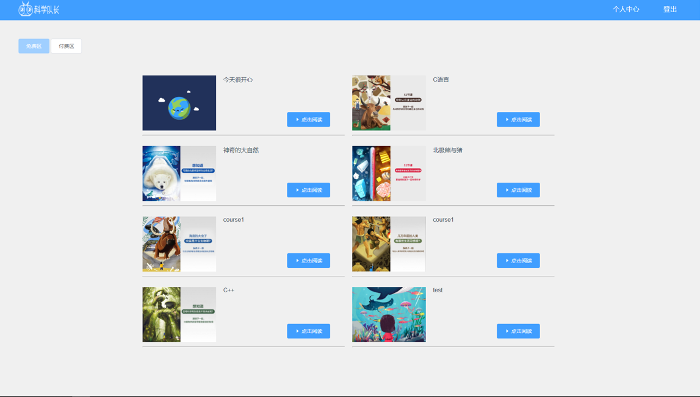
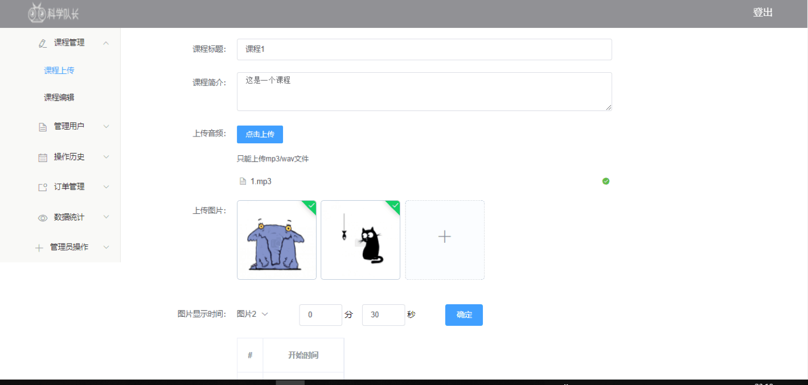
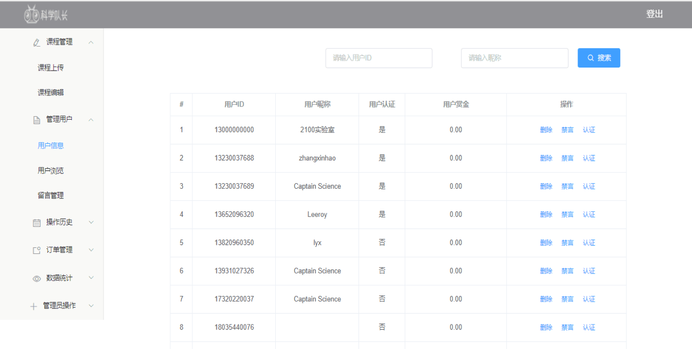

#2100实验室
##项目简介
###定位
少儿在线教育平台
###课程
图片/动图 + 音频
###两大系统
- 课程系统：用户（3-12岁儿童）
- 后台管理系统：运营者（网站管理员）

###界面截图

用户前台




课程播放


个人中心


课程上传




后台管理



##开发环境（Feodora27 Python37 Environment）
### Before Use
1. Install VirtualBox platform packages(Be aware of the operating system type and platform):
    - https://www.virtualbox.org/wiki/Downloads
    - You may need VirtualBox Extension Pack. Please install it according to your actual needs.

2. Install Vagrant(Be aware of the operating system type and platform)
    - https://www.vagrantup.com/downloads.html

3. You may install `vagrant-vbguest`.

    ```
    vagrant plugin install vagrant-vbguest
    ```

### Usage

Now it is time for you to use our Environment.

Follow the commands below.

```
git clone https://github.com/zhangxinhao/2100lab.git
cd 2100lab
vagrant plugin install vagrant-vbguest
vagrant up
vagrant ssh
```

If you see any feedback that looks like

```
Operation timed out after 30002 milliseconds with 0 out of 0 bytes received
```

and lead you to something like

```
The SSH command responded with a non-zero exit status
```

then you should find a better network environment and execute

```
vagrant destroy
```

Entry `y` then

```
vagrant up --provision
```

### Test whether it is done

#### Test 1

Within the root folder where `Vagrantfile` locates, create a new file. Let us call it `TESTFILE`. You can do it by using

```
touch TESTFILE
```

Then you should

```
vagrant ssh
```

to get into the virtual machine and see

```
[vagrant@localhost ~]
```

Now you can switch into some folder `/vagrant` by using

```
cd /vagrant
```

Then check whether `TESTFILE` is synced or not by using

```
ls -l
```

You should then get something similar to the following

```
total 8
-rwxr-xr-x. 1 501 games 1803 Jul 27 05:41 README.md
-rw-rw-r--. 1 501 games    0 Jul 27 05:44 TESTFILE
-rwxr-xr-x. 1 501 games 1484 Jul 27 05:27 Vagrantfile
```

If so, do not forget to remove the `TESTFILE` since this test is passed and the `TESTFILE` is no more useful.

#### Test 2

Type in `python` or `python3` or `python3.7` you should get

```
Python 3.7.0 (default, Jun 28 2018, 08:59:52)
[GCC 7.3.1 20180303 (Red Hat 7.3.1-5)] on linux
Type "help", "copyright", "credits" or "license" for more information.
>>>
```

#### Test 3

Type in `pip --version` or `pip3 --version` you should get

```
pip 18.0 from /home/vagrant/.local/lib/python3.7/site-packages/pip (python 3.7)
```
##部署文档
创建数据库，例：

```
create database 2100Lab
default character set utf8
collate utf8_unicode_ci;
```
创建成功后进入数据库，将`backend_user`中超管的 `id` 设置为刚才的手机号，`manage_right`设置为`31`。
之后在表`backend_rightslist`中，插入五组数据，`id`和`right`字段分别为：

- `0` `adminManage`
- `1` `courseManage`
- `2` `userManage`
- `3` `operationHistory`
- `4` `orderManage`

在表`backend_orderstatus`中，插入三组数据，`status_code`和`status`分别为：

- `0` `已支付`
- `1` `未支付`
- `2` `已退款`

在表`bachend_operation`中，插入十组数据，`operation_code`为`1`至`10`，`operation`依次为：

`Uploaded course`, `Edited course`, `Delete user`, `Banned user`, `Authorized user`, `Delete message`, `Refunded`, `Add admin`, `Edited admin`, `Deleted admin`

进入虚拟机

```
git clone https://github.com/zhangxinhao/2100lab.git
cd 2100lab
pip install -r requirements.txt
cd frontend
npm install
npm run build
cd ..
cd server
./manage.py migrate
./manage.py createsuperuser
./manage.py runserver 0:8000
```
现在从浏览器输入网址：`http://192.168.55.33:8000/`即可进入首页，输入网址：`http://192.168.55.33:8000/adminlogin`用超管账户进入管理端后台。